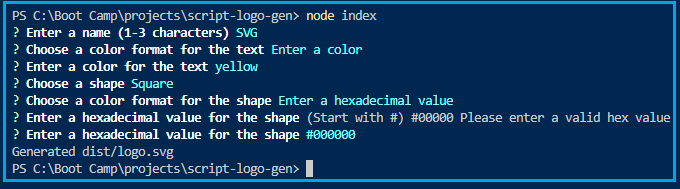
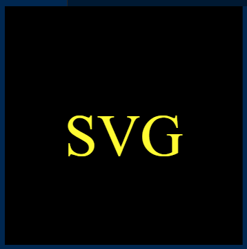

  
  # SVG Logo Generator 

  ## Description

  The function of this application is to generate a logo based on user input. It will ask a series of questions and then generate a logo around the user's response. The logo will include a few letters and a shape. The user will choose a color for the letters and a color for the shape. The color can be entered as a color name or a hex value.

  The technologies used in the development or operation of this application include Node.js as the runtime environment and the Inquirer module to produce the question and response functionality.
  
  The challenges of developing this application was running into a render error in my original design. I could not figure it out, so I started over with a new design.
    
  No plans of future development for this application right now.

  ## Table of Contents

  * [Screenshots](#screenshots)

  * [Video](#video) 

  ## Screenshots

  

  

  ## Video

  This video demonstrates the operation and output of the logo generator.

  https://drive.google.com/file/d/1jjGG7naW3bR623WI8i5wxMmaFRE9qJMA/view?usp=sharing
    
  ## Tests

  